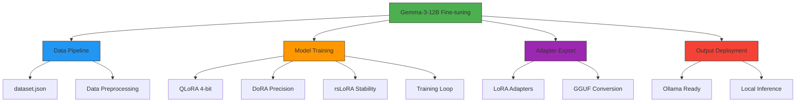

# Gemma-3-12B Fine-tuning with Unsloth Stack

This project implements the "Trinity" architecture for fine-tuning Gemma-3-12B on
constrained hardware using:
- **QLoRA** (4-bit quantization)
- **DoRA** (Weight-Decomposed Adaptation)
- **rsLoRA** (Rank-Stabilized LoRA)

## Architecture Overview

To maximize reasoning capabilities on constrained hardware, we implement a hybrid
QDoRA + rsLoRA architecture:

1. **QLoRA (Base)**: Utilized 4-bit NormalFloat (NF4) quantization to compress the
Gemma-3-12B memory footprint by 60%, allowing it to fit entirely on a single
Nvidia T4 (16GB) GPU.

2. **rsLoRA (Stability)**: Implemented Rank-Stabilized LoRA to mathematically
correct the scaling factor, allowing us to scale the adapter Rank to 64. This
increased the model's capacity to learn complex domain-specific syntax without the
gradient collapse typical of high-rank standard LoRA.

3. **DoRA (Precision)**: Enabled Weight-Decomposed Adaptation to ensure these
high-rank updates were applied with directional precision, minimizing the
quantization error penalty.

## Hardware Requirements

- **Platform**: Google Colab (Free Tier)
- **Accelerator**: NVIDIA T4 GPU (16GB VRAM)
- **Memory Usage**: ~15.6GB (Critical usage, nearly 98% of T4 capacity)

## Installation

### Using uv (recommended)

```bash
uv pip install unsloth "xformers<0.0.27" "trl<0.9.0" peft accelerate bitsandbytes
```

## Directory Structure



## Methodology

### Memory Management
Standard 12B training requires ~24GB VRAM. We fit it on 16GB using:
- Model Weights (4-bit QLoRA): ~7.6 GB
- Gradients (Rank 64 + DoRA): ~5.5 GB
- Context Overhead (4096 seq): ~2.5 GB
- Total: ~15.6 GB (98% Capacity)

## Risk Management

### OOM Protocol
If encountering "CUDA Out of Memory" errors:
1. Lower Context: Change max_seq_length from 4096 → 2048
2. Lower Rank: Change Rank from 64 → 32
3. Disable DoRA: Set use_dora to False

## Output Format

Final model exported in GGUF format for local inference via Ollama:
- Quantization: q4_k_m
- Ready for deployment: `output/gguf/`

## License

This project is licensed under the MIT License - see the LICENSE file for details.
