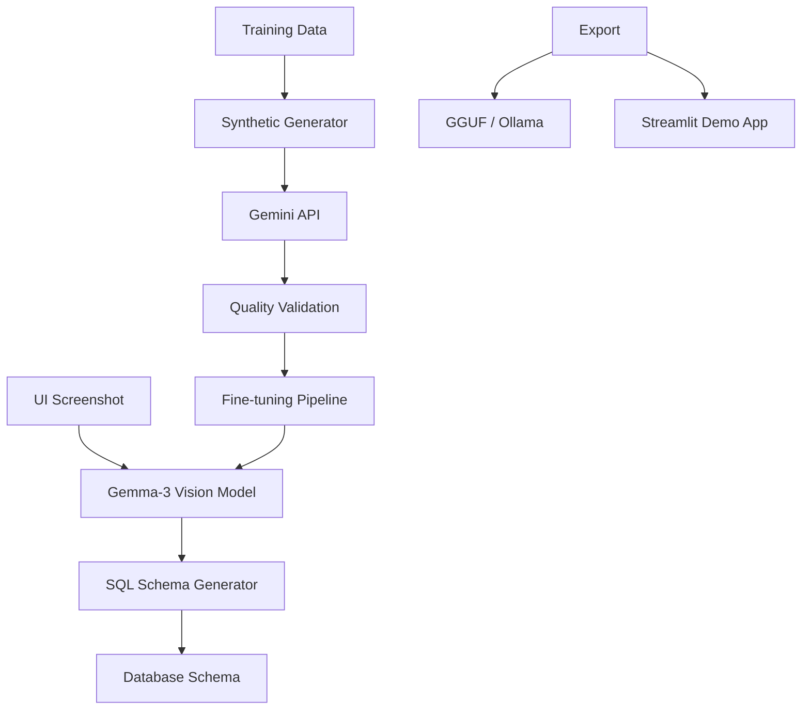

# Gemma-3 Ghost Architect: System Architecture

## Overview
The Ghost Architect is a multimodal AI system that converts UI screenshots into database schemas using a fine-tuned Gemma-3-12B model. This document details the complete system architecture, from training pipeline to production deployment.

---

## 1. System Architecture Overview



---

## 2. Project Structure

```
ghost_architect_gemma3/
├── configs/
│   └── training_config.yaml        # Phase 1 config (used by Makefile + src/train.py)
│
├── scripts/
│   ├── build_vision_dataset.py     # Builds dataset_vision.json from screenshots + Gemini
│   ├── download_datasets.py        # Playwright scraper for UI screenshots
│   ├── generate_training_data.py   # Generates Phase 1 starter data
│   ├── validate_dataset.py         # Validates dataset.json (make dataset-check)
│   └── validate_environment.py     # Validates GPU/deps (make validate)
│
├── src/                            # Source code
│   ├── __init__.py
│   ├── train.py                    # Phase 1: Trinity text training
│   ├── train_vision.py             # Colab T4 vision training (QLoRA+rsLoRA)
│   ├── modal_train.py              # Modal A10G vision training (full Trinity)
│   ├── inference.py                # CLI testing with rich terminal output
│   ├── app.py                      # Streamlit web app (upload screenshot → schema)
│   ├── export.py                   # GGUF export for Ollama
│   └── synthetic_generator.py      # Gemini API for SQL generation from screenshots
│
├── data/                           # Training data
│   ├── dataset.json                # Phase 1: Text training data
│   ├── dataset_vision.json         # Phase 2: 287 vision training examples
│   ├── ui_screenshots/             # 287 PNGs (107MB)
│   ├── raw_csvs/                   # Source CSVs for scraper
│   ├── synthetic_pairs/            # (empty, for future use)
│   └── validation_set/             # (empty, for future use)
│
├── output/                         # Model outputs (gitignored)
│   ├── adapters/                   # LoRA adapter weights
│   └── gguf/                       # GGUF models for Ollama
│
├── tests/
│   └── __init__.py                 # Test package (no tests yet)
│
├── notebooks/
│   └── main.ipynb                  # Colab T4 notebook
│
├── docs/                           # Documentation
├── docker/                         # Docker setup (future)
│
├── Makefile                        # Build targets
├── requirements.txt                # Python dependencies
├── README.md
├── DATASET_README.md
├── SECURITY.md
└── LICENSE
```

---

## 3. Phase 1: Trinity Architecture (Text Fine-Tuning)

### 3.1 Model Configuration
```python
# Trinity Architecture Components:

# QLoRA (4-bit Quantization)
quantization_config = BitsAndBytesConfig(
    load_in_4bit=True,
    bnb_4bit_quant_type="nf4",
    bnb_4bit_compute_dtype=torch.float16,
    bnb_4bit_use_double_quant=True
)

# DoRA (Weight-Decomposed Adaptation)
peft_config = LoraConfig(
    r=64,                    # High-rank adaptation
    lora_alpha=32,
    target_modules=[
        "q_proj", "k_proj", "v_proj", "o_proj",
        "gate_proj", "up_proj", "down_proj"
    ],
    use_dora=True,          # Enable DoRA
    use_rslora=True,        # Enable rsLoRA for stability
    lora_dropout=0.1,
    bias="none",
    task_type="CAUSAL_LM"
)
```

### 3.2 Memory Optimization Strategy
```python
# Target Memory Usage: 15.6GB on T4 GPU (16GB total)
memory_allocation = {
    "model_weights_4bit": 7.6,      # GB - Quantized model
    "gradients_rank64": 5.5,        # GB - High-rank LoRA gradients  
    "context_overhead": 2.5,        # GB - 4096 token context
    "system_buffer": 0.4,           # GB - System overhead
    "total": 15.6                   # GB - 98% GPU utilization
}

# OOM Recovery Protocol
oom_fallback_steps = [
    {"action": "reduce_context", "from": 4096, "to": 2048, "memory_saved": 2.0},
    {"action": "reduce_rank", "from": 64, "to": 32, "memory_saved": 2.8},
    {"action": "disable_dora", "memory_saved": 1.5},
    {"action": "reduce_rank", "from": 32, "to": 16, "memory_saved": 1.4}
]
```

### 3.3 Training Pipeline Architecture
```python
class TrinityTrainer:
    def __init__(self):
        self.memory_monitor = GPUMemoryMonitor()
        self.oom_recovery = OOMRecoverySystem()
        self.metrics_tracker = TrainingMetrics()
    
    def train(self):
        # Pre-training validation
        self.validate_environment()
        
        # Load model with Trinity configuration
        model = self.load_model_with_trinity()
        
        # Execute training with monitoring
        for epoch in range(max_epochs):
            self.train_epoch(model)
            self.validate_checkpoint()
            self.save_checkpoint()
```

---

## 4. Phase 2: Ghost Architect (Vision Training)

### 4.1 Two Training Paths

Ghost Architect offers two vision training paths depending on available hardware:

| | **Modal A10G** (`src/modal_train.py`) | **Colab T4** (`src/train_vision.py`) |
|---|---|---|
| **Trinity** | Full: QLoRA + DoRA + rsLoRA | QLoRA + rsLoRA only (no DoRA) |
| **Vision layers** | `finetune_vision_layers=True` | `finetune_vision_layers=False` |
| **Epochs / Context** | 3 epochs, 4096 ctx | 1 epoch, 2048 ctx |
| **Cost** | ~$1.65 (from free $30 credits) | Free |

> **DoRA bug:** PEFT's `dora.py` passes fp16 `x_eye` to fp32 `lora_A` without casting. Unsloth's Gemma3 temporary fp16 patch triggers this on T4. `modal_train.py` includes an inline monkey-patch; `train_vision.py` disables DoRA.

### 4.2 Vision Dataset Format
```python
# No top-level "images" column. Image paths embedded in messages:
{
    "messages": [
        {"role": "user", "content": [
            {"type": "image", "image": "data/ui_screenshots/example.png", "text": ""},
            {"type": "text", "text": "Analyze this UI and generate the database schema."}
        ]},
        {"role": "assistant", "content": "CREATE TABLE users (...)"}
    ]
}
# This avoids TRL's _is_vision_dataset check.
# UnslothVisionDataCollator falls back to process_vision_info() → fetch_image() → Image.open(path).
```

### 4.3 Synthetic Dataset Generation
```python
# File: src/synthetic_generator.py
# Uses Gemini API (google-generativeai) to auto-generate SQL annotations from screenshots.
# Called by scripts/build_vision_dataset.py to produce data/dataset_vision.json (287 examples).
```

---

## 5. Data Architecture

### 5.1 Training Data Structure
```python
# Phase 1: Text Fine-tuning Data (data/dataset.json)
text_training_format = [
    {
        "instruction": "Clear task instruction",
        "input": "Optional context",
        "output": "Expected response"
    }
]

# Phase 2: Vision Training Data (data/dataset_vision.json)
# 287 examples. Image paths embedded in messages (no top-level "images" column):
vision_training_format = {
    "messages": [
        {"role": "user", "content": [
            {"type": "image", "image": "data/ui_screenshots/example.png", "text": ""},
            {"type": "text", "text": "Analyze this UI and generate the database schema."}
        ]},
        {"role": "assistant", "content": "CREATE TABLE users (...)"}
    ]
}
```

### 5.2 Quality Metrics & Validation
```bash
# Validate Phase 1 dataset:
make dataset-check   # runs scripts/validate_dataset.py

# Validate/rebuild Phase 2 dataset:
python scripts/build_vision_dataset.py
```

---

## 6. Infrastructure & Deployment

### 6.1 Development Environment
```yaml
# Development Stack
development:
  platforms:
    - "Google Colab (T4 GPU, 16GB VRAM) — free"
    - "Modal (A10G GPU, 24GB VRAM) — ~$1.65 per run"
  python: "3.11+"
  cuda: "12.1+"
  
# Core Dependencies
core_dependencies:
  - unsloth==2026.1.4
  - transformers>=4.38.0
  - torch>=2.1.0
  - peft>=0.7.0
  - trl>=0.18.2,<=0.24.0,!=0.19.0
  - bitsandbytes>=0.41.0
  - accelerate>=0.25.0
  - google-generativeai          # Gemini API for synthetic SQL generation
  - streamlit                    # Interactive demo app
  # xformers is optional; do not force-install on Colab T4 if no wheel is available.
```

### 6.2 Deployment Model

The project deploys locally, not as a web API:

1. **Export to GGUF**: `python src/export.py` → `output/gguf/`
2. **Run with Ollama**: `ollama create ghost-architect -f Modelfile && ollama run ghost-architect`
3. **Interactive demo**: `streamlit run src/app.py` (upload screenshot → see schema)
4. **CLI testing**: `python src/inference.py` (rich terminal output)

> There is no FastAPI/uvicorn server. The `docker/` directory is reserved for future containerized deployment.

---

## 7. Performance Targets

```python
performance_targets = {
    "training": {
        "memory_usage": "<16GB on T4 GPU, <24GB on A10G",
        "training_speed": ">100 tokens/second",
        "convergence": "loss < 0.5 by end of training"
    },
    "inference": {
        "gguf_latency": "<5 seconds per request via Ollama",
        "accuracy": ">90% valid SQL schemas",
        "model_size": "<8GB GGUF file"
    }
}
```

---

## 8. Security

See `SECURITY.md` for full security practices. Key points:
- No hardcoded secrets; API keys loaded via environment variables
- `.env` protected in `.gitignore`
- Input validation in all scripts

---

This architecture covers the Ghost Architect system from text fine-tuning through vision training and local GGUF deployment.
