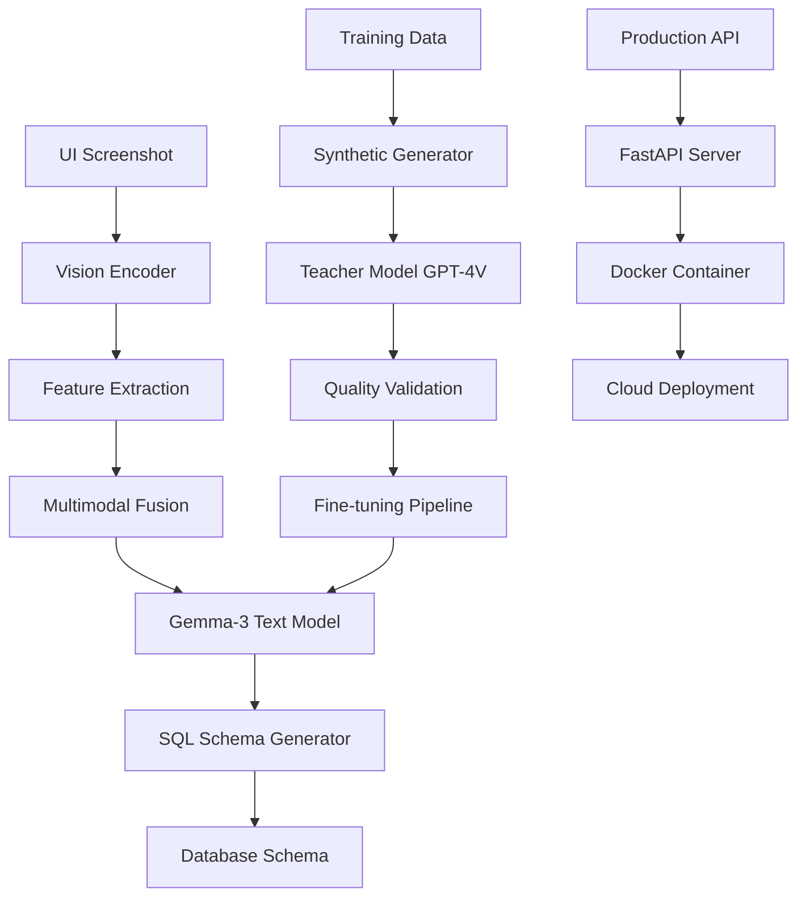
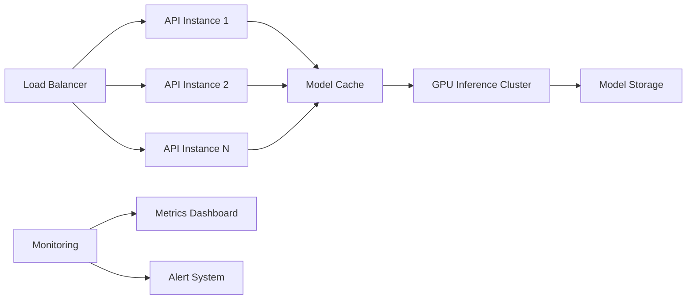

# Gemma-3 Ghost Architect: System Architecture

## Overview
The Ghost Architect is a multimodal AI system that converts UI screenshots into database schemas using a fine-tuned Gemma-3-12B model. This document details the complete system architecture, from training pipeline to production deployment.

---

## 1. System Architecture Overview



---

## 2. Project Structure

```
gemma3-peft/
├── docs/                           # Documentation
│   ├── architecture.md            # This file
│   ├── plan.md                    # Implementation plan
│   ├── prd.md                     # Product requirements
│   └── ai_rules.md               # Quality control rules
│
├── src/                          # Source code
│   ├── __init__.py
│   ├── train.py                  # Phase 1: Trinity training
│   ├── inference.py              # Model inference utilities
│   ├── multimodal_model.py       # Phase 2: Multimodal architecture
│   ├── synthetic_generator.py    # Dataset generation system
│   ├── data_processing.py        # Data preprocessing utilities
│   ├── export.py                 # GGUF export functionality
│   │
│   ├── models/                   # Model definitions
│   │   ├── __init__.py
│   │   ├── trinity_config.py     # QLoRA + DoRA + rsLoRA config
│   │   ├── vision_encoder.py     # Vision processing components
│   │   └── multimodal_fusion.py  # Cross-modal integration
│   │
│   ├── training/                 # Training utilities
│   │   ├── __init__.py
│   │   ├── memory_monitor.py     # GPU memory tracking
│   │   ├── oom_recovery.py       # Out-of-memory handling
│   │   └── metrics.py            # Training metrics
│   │
│   ├── data/                     # Data processing
│   │   ├── __init__.py
│   │   ├── ui_analyzer.py        # UI element detection
│   │   ├── sql_validator.py      # Schema validation
│   │   └── quality_filter.py     # Data quality assurance
│   │
│   └── api/                      # Production API
│       ├── __init__.py
│       ├── main.py               # FastAPI application
│       ├── models.py             # API data models
│       ├── endpoints.py          # API endpoints
│       └── middleware.py         # Authentication/validation
│
├── data/                         # Training data
│   ├── dataset.json             # Phase 1: Text training data
│   ├── ui_screenshots/          # Phase 2: UI images
│   ├── synthetic_pairs/         # Generated UI-SQL pairs
│   └── validation_set/          # Test/validation data
│
├── output/                      # Model outputs
│   ├── adapters/               # LoRA adapter weights
│   │   ├── phase1/            # Text fine-tuning adapters
│   │   └── phase2/            # Multimodal adapters
│   ├── checkpoints/           # Training checkpoints
│   └── gguf/                  # Production GGUF models
│
├── scripts/                    # Utility scripts
│   ├── setup_environment.py   # Environment initialization
│   ├── download_datasets.py   # Data acquisition scripts
│   ├── run_training.py        # Training execution script
│   ├── export_model.py        # Model export automation
│   └── deploy.py              # Deployment automation
│
├── tests/                      # Test suite
│   ├── __init__.py
│   ├── test_training.py       # Training pipeline tests
│   ├── test_inference.py      # Model inference tests
│   ├── test_api.py            # API endpoint tests
│   └── test_quality.py        # Quality validation tests
│
├── configs/                    # Configuration files
│   ├── training_config.yaml   # Training parameters
│   ├── model_config.yaml      # Model architecture settings
│   └── deployment_config.yaml # Production deployment settings
│
├── notebooks/                  # Jupyter notebooks
│   ├── 01_environment_setup.ipynb     # Colab setup and validation
│   ├── 02_trinity_training.ipynb      # Phase 1 training
│   ├── 03_dataset_generation.ipynb    # Synthetic data creation
│   ├── 04_multimodal_training.ipynb   # Phase 2 training
│   └── 05_evaluation.ipynb            # Model evaluation
│
├── docker/                     # Container definitions
│   ├── Dockerfile             # Production container
│   ├── docker-compose.yml     # Local development
│   └── requirements.txt       # Container dependencies
│
├── .github/                    # GitHub workflows
│   └── workflows/
│       ├── tests.yml          # Automated testing
│       └── deploy.yml         # Deployment pipeline
│
├── requirements.txt            # Python dependencies
├── .gitignore                 # Git ignore patterns
├── README.md                  # Project overview
└── LICENSE                    # License file
```

---

## 3. Phase 1: Trinity Architecture (Text Fine-Tuning)

### 3.1 Model Configuration
```python
# Trinity Architecture Components:

# QLoRA (4-bit Quantization)
quantization_config = BitsAndBytesConfig(
    load_in_4bit=True,
    bnb_4bit_quant_type="nf4",
    bnb_4bit_compute_dtype=torch.float16,
    bnb_4bit_use_double_quant=True
)

# DoRA (Weight-Decomposed Adaptation)
peft_config = LoraConfig(
    r=64,                    # High-rank adaptation
    lora_alpha=32,
    target_modules=[
        "q_proj", "k_proj", "v_proj", "o_proj",
        "gate_proj", "up_proj", "down_proj"
    ],
    use_dora=True,          # Enable DoRA
    use_rslora=True,        # Enable rsLoRA for stability
    lora_dropout=0.1,
    bias="none",
    task_type="CAUSAL_LM"
)
```

### 3.2 Memory Optimization Strategy
```python
# Target Memory Usage: 15.6GB on T4 GPU (16GB total)
memory_allocation = {
    "model_weights_4bit": 7.6,      # GB - Quantized model
    "gradients_rank64": 5.5,        # GB - High-rank LoRA gradients  
    "context_overhead": 2.5,        # GB - 4096 token context
    "system_buffer": 0.4,           # GB - System overhead
    "total": 15.6                   # GB - 98% GPU utilization
}

# OOM Recovery Protocol
oom_fallback_steps = [
    {"action": "reduce_context", "from": 4096, "to": 2048, "memory_saved": 2.0},
    {"action": "reduce_rank", "from": 64, "to": 32, "memory_saved": 2.8},
    {"action": "disable_dora", "memory_saved": 1.5},
    {"action": "reduce_rank", "from": 32, "to": 16, "memory_saved": 1.4}
]
```

### 3.3 Training Pipeline Architecture
```python
class TrinityTrainer:
    def __init__(self):
        self.memory_monitor = GPUMemoryMonitor()
        self.oom_recovery = OOMRecoverySystem()
        self.metrics_tracker = TrainingMetrics()
    
    def train(self):
        # Pre-training validation
        self.validate_environment()
        
        # Load model with Trinity configuration
        model = self.load_model_with_trinity()
        
        # Execute training with monitoring
        for epoch in range(max_epochs):
            self.train_epoch(model)
            self.validate_checkpoint()
            self.save_checkpoint()
```

---

## 4. Phase 2: Ghost Architect (Multimodal System)

### 4.1 Multimodal Architecture
```python
class GhostArchitect(nn.Module):
    def __init__(self):
        # Vision Components
        self.vision_encoder = CLIPVisionModel.from_pretrained("openai/clip-vit-base-patch32")
        self.vision_projector = nn.Linear(768, 4096)  # Project to text model dimension
        
        # Text Components  
        self.text_model = load_gemma3_with_trinity()
        
        # Multimodal Fusion
        self.fusion_attention = MultiheadAttention(4096, 32)
        self.fusion_norm = LayerNorm(4096)
        
        # SQL Generation Head
        self.sql_head = nn.Sequential(
            nn.Linear(4096, 2048),
            nn.ReLU(),
            nn.Dropout(0.1),
            nn.Linear(2048, vocab_size)
        )
    
    def forward(self, image, text_input):
        # Process image
        vision_features = self.vision_encoder(image)
        vision_projected = self.vision_projector(vision_features)
        
        # Process text
        text_features = self.text_model.get_input_embeddings()(text_input)
        
        # Multimodal fusion
        fused_features = self.fusion_attention(
            text_features, vision_projected, vision_projected
        )[0]
        fused_features = self.fusion_norm(fused_features + text_features)
        
        # Generate SQL schema
        sql_logits = self.sql_head(fused_features)
        return sql_logits
```

### 4.2 Synthetic Dataset Generation Architecture
```python
class SyntheticDatasetGenerator:
    def __init__(self):
        self.teacher_model = "gpt-4-vision-preview"
        self.ui_analyzer = UIElementDetector()
        self.sql_validator = SQLSchemaValidator()
        self.quality_filter = DataQualityFilter()
    
    def generate_dataset(self, ui_images):
        synthetic_pairs = []
        
        for image_path in ui_images:
            # Analyze UI structure
            ui_elements = self.ui_analyzer.detect_elements(image_path)
            
            # Generate schema with teacher model
            schema = self.query_teacher_model(image_path, ui_elements)
            
            # Validate and filter
            if self.validate_pair(image_path, schema):
                synthetic_pairs.append({
                    "image": image_path,
                    "schema": schema,
                    "ui_elements": ui_elements,
                    "complexity_score": self.calculate_complexity(ui_elements)
                })
        
        return synthetic_pairs
    
    def query_teacher_model(self, image, ui_elements):
        prompt = f"""
        Act as a Senior Database Architect. Analyze this UI screenshot and infer 
        the PostgreSQL database schema required to support this interface.
        
        UI Elements Detected: {ui_elements}
        
        Generate a complete PostgreSQL schema including:
        1. All necessary tables
        2. Primary keys and foreign keys
        3. Appropriate data types
        4. Indexes for performance
        5. Constraints and validations
        
        Output ONLY valid PostgreSQL SQL.
        """
        
        return self.teacher_model.generate(image, prompt)
```

### 4.3 Production API Architecture
```python
# FastAPI Production System
from fastapi import FastAPI, UploadFile, HTTPException
from pydantic import BaseModel

class SchemaRequest(BaseModel):
    image: UploadFile
    output_format: str = "postgresql"
    include_indexes: bool = True
    include_constraints: bool = True

class SchemaResponse(BaseModel):
    sql_schema: str
    confidence_score: float
    ui_elements_detected: List[str]
    complexity_rating: str
    execution_time: float

app = FastAPI(title="Ghost Architect API")

@app.post("/generate-schema", response_model=SchemaResponse)
async def generate_database_schema(request: SchemaRequest):
    try:
        # Process uploaded image
        image = await process_uploaded_image(request.image)
        
        # Load Ghost Architect model
        model = load_ghost_architect_model()
        
        # Generate schema
        schema_result = model.generate_schema(
            image=image,
            output_format=request.output_format,
            include_indexes=request.include_indexes,
            include_constraints=request.include_constraints
        )
        
        return SchemaResponse(**schema_result)
        
    except Exception as e:
        raise HTTPException(status_code=500, detail=str(e))

# Health check and monitoring
@app.get("/health")
async def health_check():
    return {"status": "healthy", "model_loaded": check_model_status()}
```

---

## 5. Data Architecture

### 5.1 Training Data Structure
```python
# Phase 1: Text Fine-tuning Data
text_training_format = {
    "conversations": [
        {
            "instruction": "Clear task instruction",
            "input": "Optional context",
            "output": "Expected response"
        }
    ]
}

# Phase 2: Multimodal Training Data
multimodal_training_format = {
    "image_path": "path/to/ui_screenshot.png",
    "ui_analysis": {
        "elements": ["form", "table", "navigation", "cards"],
        "relationships": ["user_profile", "order_history"],
        "complexity": "medium"
    },
    "sql_schema": "CREATE TABLE users (...); CREATE TABLE orders (...);"
}
```

### 5.2 Quality Metrics & Validation
```python
class DataQualityValidator:
    def validate_ui_sql_pair(self, image, schema):
        checks = {
            "sql_syntax_valid": self.validate_sql_syntax(schema),
            "ui_elements_mapped": self.check_element_mapping(image, schema),
            "relationships_correct": self.validate_relationships(schema),
            "complexity_appropriate": self.check_complexity_match(image, schema),
            "schema_complete": self.validate_completeness(schema)
        }
        
        return all(checks.values()), checks
```

---

## 6. Infrastructure & Deployment

### 6.1 Development Environment
```yaml
# Development Stack
development:
  platform: "Google Colab Pro"
  gpu: "NVIDIA T4 (16GB VRAM)"
  python: "3.11+"
  cuda: "12.1+"
  
# Dependencies
core_dependencies:
  - unsloth==2026.1.4
  - transformers>=4.38.0
  - torch>=2.1.0
  - xformers<0.0.27
  - peft>=0.7.0
  - trl<0.9.0
  - bitsandbytes>=0.41.0
  - accelerate>=0.25.0
```

### 6.2 Production Deployment
```docker
# Production Container
FROM nvidia/cuda:12.1-runtime-ubuntu22.04

# Install Python and dependencies
RUN apt-get update && apt-get install -y python3.11 python3-pip
COPY requirements.txt .
RUN pip install -r requirements.txt

# Copy application
COPY src/ /app/src/
COPY output/gguf/ /app/models/

# Set environment
ENV MODEL_PATH=/app/models/ghost-architect.gguf
ENV API_HOST=0.0.0.0
ENV API_PORT=8000

# Run application
CMD ["uvicorn", "src.api.main:app", "--host", "${API_HOST}", "--port", "${API_PORT}"]
```

### 6.3 Scalability Architecture


---

## 7. Performance & Monitoring

### 7.1 Performance Targets
```python
performance_targets = {
    "training": {
        "memory_usage": "<16GB on T4 GPU",
        "training_speed": ">100 tokens/second",
        "convergence_time": "<4 hours for Phase 1"
    },
    "inference": {
        "api_latency": "<5 seconds per request",
        "throughput": ">10 requests/minute",
        "accuracy": ">90% valid SQL schemas"
    },
    "scalability": {
        "concurrent_users": ">100 simultaneous requests",
        "model_size": "<8GB GGUF file",
        "startup_time": "<30 seconds"
    }
}
```

### 7.2 Monitoring & Observability
```python
class SystemMonitor:
    def __init__(self):
        self.metrics_collector = MetricsCollector()
        self.alerting_system = AlertingSystem()
    
    def track_training_metrics(self):
        return {
            "gpu_memory_usage": self.get_gpu_memory(),
            "training_loss": self.get_current_loss(),
            "learning_rate": self.get_learning_rate(),
            "tokens_per_second": self.get_training_speed(),
            "checkpoint_size": self.get_checkpoint_size()
        }
    
    def track_inference_metrics(self):
        return {
            "request_latency": self.measure_latency(),
            "sql_validity_rate": self.check_sql_validity(),
            "model_confidence": self.get_confidence_scores(),
            "error_rate": self.calculate_error_rate(),
            "resource_utilization": self.get_resource_usage()
        }
```

---

## 8. Security & Compliance

### 8.1 Security Architecture
```python
security_measures = {
    "input_validation": [
        "Image format validation",
        "File size limits (max 10MB)",
        "Content scanning for malicious files",
        "Rate limiting per IP"
    ],
    "api_security": [
        "JWT authentication",
        "HTTPS encryption",
        "CORS policy enforcement",
        "Input sanitization"
    ],
    "model_security": [
        "Model file integrity checks",
        "Secure model loading",
        "Output content filtering",
        "Resource usage limits"
    ]
}
```

### 8.2 Privacy & Data Handling
```python
privacy_controls = {
    "data_processing": [
        "No permanent storage of user images",
        "Temporary processing only",
        "Automatic cleanup after processing",
        "No logging of sensitive content"
    ],
    "compliance": [
        "GDPR compliance for EU users",
        "Data minimization principles",
        "User consent mechanisms",
        "Right to data deletion"
    ]
}
```

---

This architecture provides a comprehensive foundation for building the Ghost Architect system, from initial text fine-tuning through production deployment of the multimodal UI-to-SQL system.